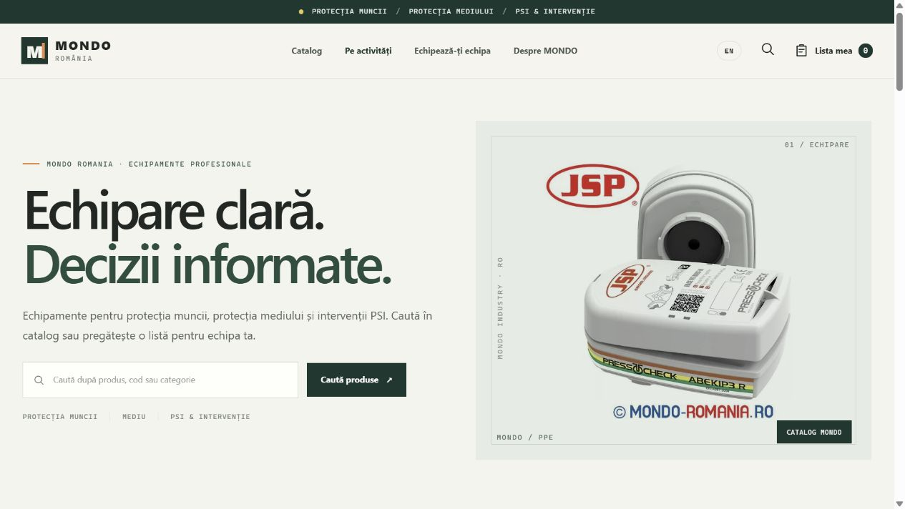
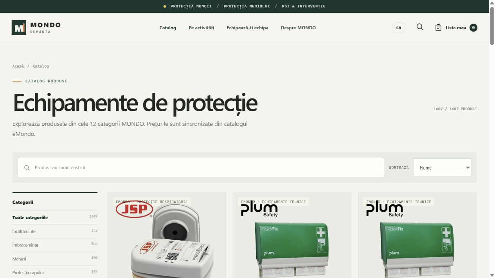
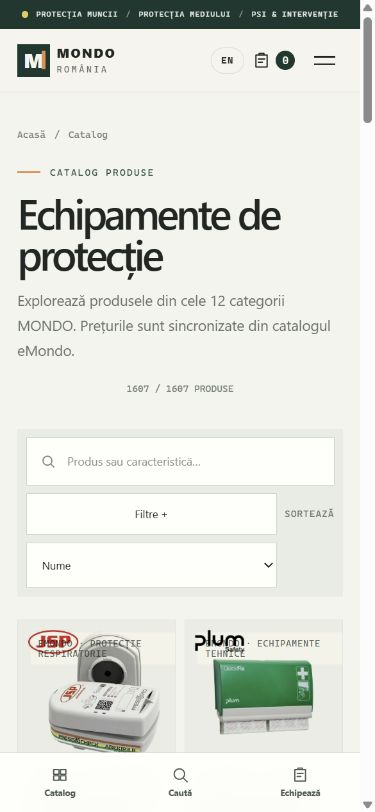
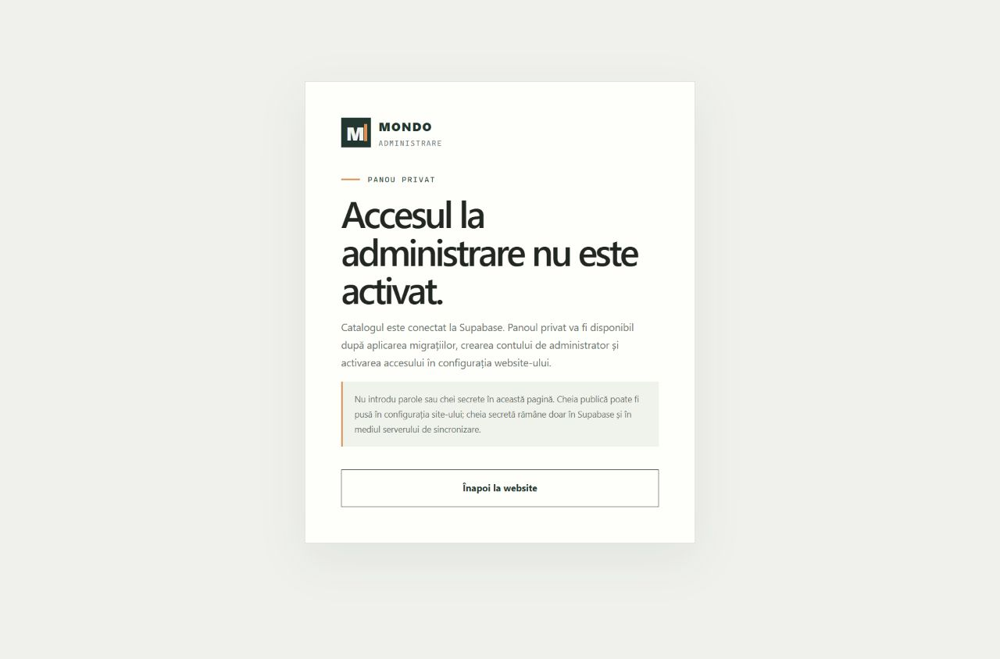
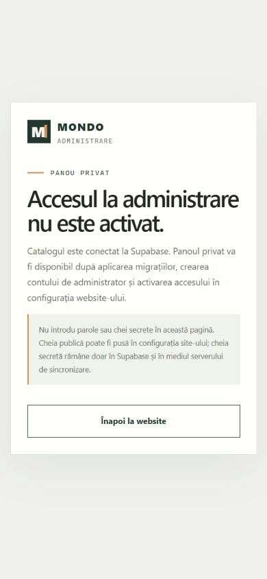

# MONDO România

Website responsive pentru catalogul MONDO: căutare, categorii, comparație de produse, listă de echipare și panou privat pentru gestionarea produselor și a cererilor de ofertă.

## Capturi de ecran

Capturile au fost realizate din versiunea locală a website-ului. Catalogul afișează cele 1.607 produse din 12 categorii. În prezent, panoul admin este dezactivat; capturile lui arată mesajul real de acces inactiv.

### Pagina principală

| Desktop | Mobil |
| --- | --- |
|  |  |

### Catalogul complet

| Desktop | Mobil |
| --- | --- |
|  |  |

### Administrare

Panoul este în spatele rutei `/admin/`. Accesul se activează după aplicarea migrațiilor, crearea utilizatorului autorizat în Supabase Auth și configurarea `adminEnabled`. Capturile de mai jos documentează pagina de administrare înainte de activarea accesului.

| Desktop | Mobil |
| --- | --- |
|  |  |

## Catalog

Catalogul curent conține **1.607 produse unice**, organizate în **12 categorii**. Website-ul citește catalogul publicat din Supabase; `data/catalog.json` este snapshot-ul local pentru sincronizare și publicare. Prețurile și informațiile comerciale provin din eMondo și trebuie confirmate cu echipa MONDO înainte de ofertare.

Pentru sincronizarea snapshot-ului local cu Node.js 20 sau mai nou:

```powershell
npm.cmd run catalog:sync
```

Pentru publicarea snapshot-ului verificat în Supabase:

```powershell
npm.cmd run catalog:publish
```

Publicarea necesită `MONDO_SUPABASE_URL` și cheia secretă Supabase `MONDO_SUPABASE_SECRET_KEY` setate temporar în shell-ul local. Cheia secretă nu se pune în `config.js`, în CSV sau în Git. Pașii sunt documentați în [docs/supabase-setup.md](docs/supabase-setup.md).

## Panou și cereri

- `/admin/` este zona privată pentru administrarea catalogului și a cererilor de ofertă.
- Produsele pot fi căutate, editate, publicate sau arhivate. Produsele sincronizate din eMondo își păstrează modificările manuale atunci când sunt trecute în administrare MONDO.
- În configurația curentă, `adminEnabled` este `false`, iar `quoteEnabled` este `false`. Accesul adminului și trimiterea cererilor nu sunt încă activate.
- Cererile de ofertă nu sunt comenzi plătite. Site-ul nu include checkout, procesator de plăți, facturare sau integrare cu un curier.

Pentru configurarea Supabase, migrații, administratori și funcția de ofertare, consultă [docs/supabase-setup.md](docs/supabase-setup.md) și [docs/data-model.md](docs/data-model.md).

## Rulare locală

În PowerShell, din folderul proiectului:

```powershell
npm.cmd run dev
```

Deschide [http://127.0.0.1:4173](http://127.0.0.1:4173). Hostingul trebuie să trimită rutele curate către `index.html`; configurația Netlify include fallback-ul.

## Fișiere principale

- `index.html`, `app.js`, `admin.js`, `styles.css` — website-ul public și interfața admin.
- `config.js` — configurația publică a website-ului și conexiunea client-side Supabase.
- `data/catalog.json` — snapshot-ul catalogului complet.
- `scripts/sync-emondo-catalog.mjs` — sincronizarea catalogului eMondo.
- `scripts/publish-catalog-to-supabase.mjs` — publicarea snapshot-ului în Supabase.
- `scripts/import-products.mjs` și `templates/catalog_import_template.csv` — importul controlat al produselor aprobate.
- `supabase/migrations/` și `supabase/functions/submit-quote/` — schema bazei de date și procesarea cererilor.
- `assets/screenshots/` — capturile desktop și mobile folosite mai sus.
- `netlify.toml`, `robots.txt`, `sitemap.xml` — configurarea hostingului și indexării.
