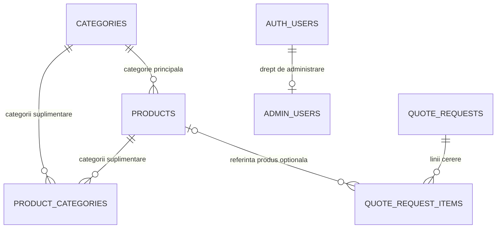

# Modelul de date MONDO

Schema de livrare păstrează catalogul, cererile de ofertă și accesul administrativ. Relațiile sunt limitate la cele folosite de website.

## Catalog

- `products.category_id` este categoria principală obligatorie a produsului.
- `product_categories` conține numai categorii suplimentare, folosite când același produs trebuie listat și în alte secțiuni. Categoria principală nu se repetă aici.
- `color_options`, `size_options` și `standards` sunt liste compacte pentru afișare și filtrare.
- `products.specifications` păstrează o listă JSON de specificații simple pentru produs.
- `manufacturer` păstrează denumirea producătorului ca text, importată din sursă. Proiecția publică o expune și sub numele `brand` pentru compatibilitatea catalogului.
- `catalog_sync_state` păstrează momentul și numărul ultimei sincronizări.
- Migrarea `202610060003_clarify_product_category_relationships.sql` elimină legăturile care repetau categoria principală și previne apariția lor din nou.
- Migrarea `202610060004_remove_unused_catalog_tables.sql` elimină relațiile nefolosite pentru branduri, traduceri, variante SKU, specificații separate și fișiere separate. Verifică înainte că sunt goale și că niciun produs nu are un brand asociat.

## Cereri și acces

- `quote_requests` păstrează datele unei cereri comerciale; `quote_request_items` păstrează produsele și cantitățile solicitate.
- `quote_request_items.product_id` este opțional, iar numele și codul produsului sunt copiate în linie pentru istoricul cererii, chiar dacă produsul se schimbă sau este șters ulterior.
- Cererile de ofertă nu sunt comenzi cu plată.
- `admin_users.user_id` este și cheia primară, și cheia străină către `auth.users.id`; doar utilizatorii enumerați în acest tabel primesc acces administrativ.

## Reguli pentru editarea catalogului

1. Salvează categoria principală în `products.category_id`.
2. Salvează în `product_categories` doar categoriile suplimentare.
3. Păstrează specificațiile simple în `products.specifications`.
4. Păstrează cererile istorice în `quote_request_items` cu nume/cod snapshot și referința opțională la produs.
