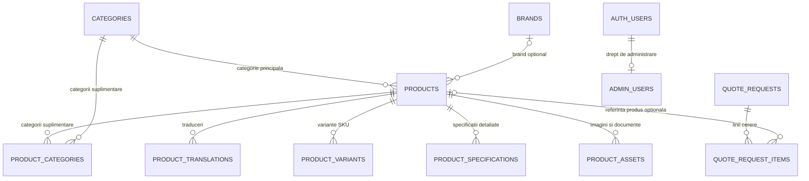

# Modelul de date MONDO

Schema este grupată după rol: catalog, cereri de ofertă și acces administrativ.

## Catalog

- `products.category_id` este categoria principală obligatorie a produsului.
- `product_categories` conține numai categorii suplimentare, folosite când același produs trebuie listat și în alte secțiuni. Categoria principală nu se repetă aici.
- `product_categories` este o relație many-to-many: un produs poate avea mai multe categorii suplimentare, iar fiecare categorie poate avea multe produse.
- `brand_id` leagă opțional produsul de `brands`. Câmpul text `manufacturer` păstrează producătorul primit de la sursă până când există o potrivire de brand administrată.
- `product_variants`, `product_specifications`, `product_assets` și `product_translations` păstrează informațiile care au propriile atribute și se pot repeta pentru un produs.
- `color_options`, `size_options` și `standards` sunt liste compacte folosite la filtrarea și afișarea catalogului sincronizat. Variantele SKU și specificațiile detaliate nu trebuie copiate redundant în aceste liste.
- `catalog_sync_state` are un singur rând pentru momentul și numărul ultimei sincronizări.

Migrarea `202610060003_clarify_product_category_relationships.sql` elimină din `product_categories` numai legăturile care repetau categoria principală deja păstrată în `products.category_id`. Nu șterge produse sau categorii. Funcția de sincronizare și panoul admin păstrează de atunci doar categoriile suplimentare în tabelul de legătură; o regulă SQL respinge dublurile viitoare.

## Cereri și acces

- `quote_requests` păstrează datele unei cereri comerciale; `quote_request_items` păstrează produsele și cantitățile solicitate.
- `quote_request_items.product_id` este opțional, iar numele și codul produsului sunt copiate în linie pentru istoricul cererii, chiar dacă produsul se schimbă sau este șters ulterior.
- Cererile de ofertă nu sunt comenzi cu plată.
- `admin_users.user_id` este și cheia primară, și cheia străină către `auth.users.id`; doar utilizatorii enumerați în acest tabel primesc acces administrativ.

## Reguli pentru editarea catalogului

1. Salvează categoria principală în `products.category_id`.
2. Salvează în `product_categories` doar categoriile suplimentare.
3. Păstrează ID-ul produsului în tabelele copil prin cheia străină `product_id`.
4. Păstrează cererile istorice în `quote_request_items` cu nume/cod snapshot și referința opțională la produs.
